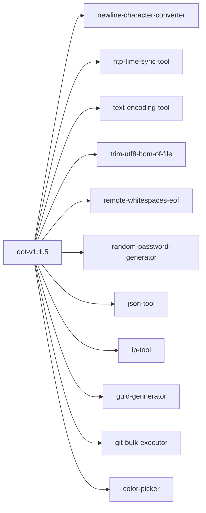

# dot

A full-featured utility - the programmer's swiss army knife

```mermaid
graph LR;
    dot-v1.1.5-->newline-character-converter;
    dot-v1.1.5-->ntp-time-sync-tool;
    dot-v1.1.5-->text-encoding-tool;
    dot-v1.1.5-->trim-utf8-bom-of-file
    dot-v1.1.5-->remote-whitespaces-eof
    dot-v1.1.5-->random-password-generator
    dot-v1.1.5-->json-tool
    dot-v1.1.5-->ip-tool
    dot-v1.1.5-->guid-gennerator
    dot-v1.1.5-->git-bulk-executor
    dot-v1.1.5-->color-picker
```