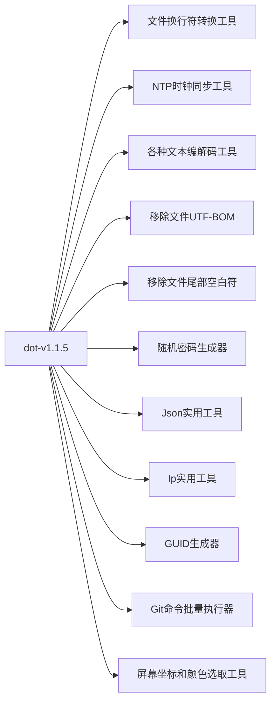

# dot

功能全面的实用工具 - 程序员的瑞士军刀

```mermaid
graph LR;
    dot-v1.1.5-->文件换行符转换工具
    dot-v1.1.5-->NTP时钟同步工具
    dot-v1.1.5-->各种文本编解码工具
    dot-v1.1.5-->移除文件UTF-BOM
    dot-v1.1.5-->移除文件尾部空白符
    dot-v1.1.5-->随机密码生成器
    dot-v1.1.5-->Json实用工具
    dot-v1.1.5-->Ip实用工具
    dot-v1.1.5-->GUID生成器
    dot-v1.1.5-->Git命令批量执行器
    dot-v1.1.5-->屏幕坐标和颜色选取工具
```